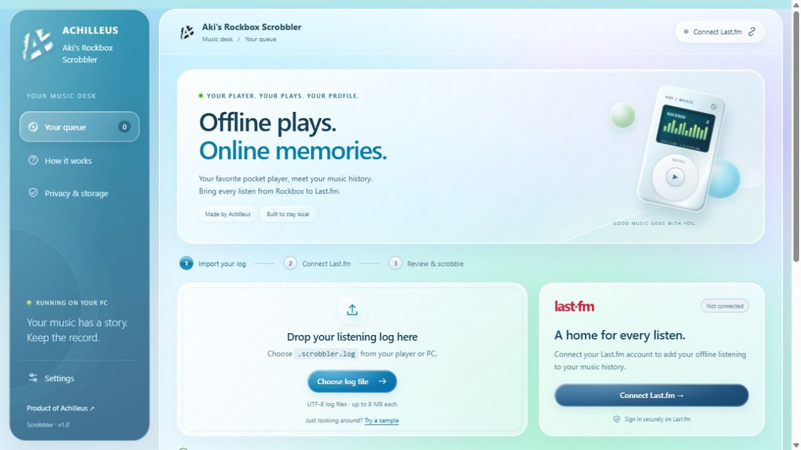

# Aki's Rockbox Scrobbler

**[Product of Achilleus](https://linktr.ee/achilleus_)** — Created and maintained by [Achilleus (Achilleus-1)](https://github.com/Achilleus-1).

Your pocket player's listening history, on Last.fm. A lightweight local app for importing Rockbox logs, reviewing your plays, and scrobbling the ones you choose — with a Frutiger Aero music desk and interactive liquid glass.

[](https://github.com/Achilleus-1/Akis-Rockbox-Scrobbler/actions/workflows/checks.yml)
[](LICENSE)
[](https://www.python.org/downloads/)



**[Download 1.0.0](https://github.com/Achilleus-1/Akis-Rockbox-Scrobbler/releases/tag/v1.0.0)** · [User guide](docs/USER_GUIDE.md) · [Troubleshooting](docs/TROUBLESHOOTING.md) · [Changelog](CHANGELOG.md)

## What you get

- Import `.scrobbler.log` directly from a connected player or from a copy on your PC.
- Search and review the queue, choose your plays, and confirm the destination Last.fm account.
- Persistent queue and account-specific duplicate protection, with explicit handling of interrupted submissions.
- Original listening dates retained locally, plus optional adjustment of outdated entries into a recent submission window.
- Live glass refraction, pointer reflections, and click ripples. Turn it off in Settings; unsupported graphics fall back automatically.
- Local assets, readable source, and Python's standard library. No package installation, telemetry, hosted backend, or bundled account credentials.

## Get started

**Requirements:** Python 3.10 or newer, a modern browser, a Rockbox scrobble log, and your own Last.fm API key and shared secret. Windows is the primary desktop platform. The source ZIP is not a standalone executable.

1. Download the ZIP from [Releases](https://github.com/Achilleus-1/Akis-Rockbox-Scrobbler/releases/latest) and extract it.
2. Double-click **Start Akis Rockbox Scrobbler.cmd**. Keep its terminal open while using the app.
3. In **Settings**, follow the link to [create a Last.fm API account](https://www.last.fm/api/account/create), then enter its key and shared secret.
4. Click **Connect Last.fm**, approve the app on Last.fm, then return and finish connecting.
5. Import `.scrobbler.log`, review the listening dates, select plays, and confirm **Scrobble selected**.

On current Rockbox builds, export the playback log using **Plugins → Applications → lastfm_scrobbler** first. Raw `playback.log` contains paths instead of the required song metadata. See the [user guide](docs/USER_GUIDE.md) for player setup and clock correction.

For another platform, launch `python3 scrobbler.py` from the extracted directory. Remembered credentials require Windows; leave that option off elsewhere.

## Listening dates and skipped entries

The exported log has an L/S flag, not measured listening duration. This app deliberately treats all otherwise valid entries as at least 50% listened, including entries marked skipped. Last.fm records plays, not a listening percentage, and can still reject a submission under its own rules.

A **14-day cutoff** applies by default. Older entries stay in the local queue as **Too old**. To submit them with newer dates, enable **Adjust outdated listening dates** in Settings and save. The app spreads eligible unsent entries across the last 13 days in their original order. **Last.fm will display those adjusted dates**; original dates remain saved on your PC. Accepted or uncertain entries are protected from automatic resubmission. [Full behavior and limits →](docs/USER_GUIDE.md#behavior)

## Local by design

The interface runs on `127.0.0.1`. Your source log is never edited. Nothing is scrobbled until you select and confirm it; requests go directly to Last.fm over HTTPS. Credentials stay in memory by default, with optional Windows DPAPI encryption. Local queue metadata is stored in SQLite under `%LOCALAPPDATA%\RockboxRelay`.

The shader renders locally, caps its frame rate and resolution, and pauses when the page is hidden. Reduced motion uses still frames; dense reading surfaces remain more opaque. Only the appearance switch is stored in browser local storage. Pointer movement is never saved or sent.

See [privacy and storage details](docs/USER_GUIDE.md#privacy-and-security) and the [security policy](SECURITY.md). This project has not received an independent security audit.

## Development

Clone the repository and run these checks. Node.js 22 or newer is used only for development checks; it is not needed to run the app.

```powershell
git clone https://github.com/Achilleus-1/Akis-Rockbox-Scrobbler.git
cd Akis-Rockbox-Scrobbler
python -m unittest discover -s tests -v
node --check web/app.js
node --check web/liquid-glass.js
node --test tests/test_liquid_glass.cjs
python scrobbler.py --no-browser --data-dir .test-data
```

Tests use fake Last.fm responses and temporary storage; they do not submit real plays. CI runs on Windows and Ubuntu with Python 3.10 and 3.12. Browser rendering is checked separately from the shader lifecycle tests.

Build the source release with `python tools/package_release.py`. The explicit file list excludes personal logs, local databases, credentials, and development tools. The ZIP and `SHA256SUMS.txt` appear in `dist/`.

[Architecture](docs/ARCHITECTURE.md) · [Contributing](CONTRIBUTING.md) · [Release process](PUBLISHING.md) · [Code of conduct](CODE_OF_CONDUCT.md)

## License and identity

Source code is licensed under [MIT](LICENSE). Achilleus branding and supplied logos identify this project; the code license does not grant trademark rights. Aki's Rockbox Scrobbler is independent of Rockbox and Last.fm.
