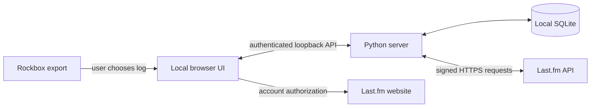

# Architecture

[Back to the project](../README.md)

The app is a Python standard-library server with a local browser interface. It has no remote application backend, build step, Python dependencies, or JavaScript runtime dependencies.

## Source map

| Path | Responsibility |
| --- | --- |
| `scrobbler.py` | Parsing, fingerprints, queue storage, date planning, signed Last.fm requests, authentication and local HTTP server. |
| `web/index.html` | Semantic UI, accessible dialogs, local SVG icons and Achilleus identity. |
| `web/app.js` | Review, filters, selection, import, authorization and submission flows. Imported values are rendered as text. |
| `web/liquid-glass.js` | Two WebGL passes: procedural environment texture and rounded refracting glass lenses aligned to DOM geometry. Pointer lighting and up to four fading ripples; no DOM or desktop capture. |
| `web/style.css` | Aero layout, glass fallback, readable queue surfaces, keyboard focus and responsive layout. |
| `tests/test_scrobbler.py` | Parser, Last.fm response matching, durable queue behavior, credentials and local HTTP guards. |
| `tests/test_liquid_glass.cjs` | Off switch, cross-tab preference, hidden-page pause, reduced motion, context loss and graphics fallback. Real GLSL compilation needs browser verification. |
| `tools/package_release.py` | Explicit source-release allowlist and SHA-256 checksum output. |

## Storage and identity

SQLite uses WAL journaling and full synchronization. The `tracks` table holds original imported metadata and source filenames. `outcomes` holds account-specific receipts and submitted timestamps. `preferences` stores history preferences; `remaps` stores planned adjusted submission dates.

Play fingerprints derive from artist, title and original timestamp. Album changes do not create another play. Date planning does not change the fingerprint. Accepted receipts survive clearing the imported queue and are scoped to the Last.fm account.

Remembered account credentials are stored separately with Windows DPAPI. Credentials otherwise remain in memory. The browser stores only its glass appearance preference in local storage. The existing `RockboxRelay` data-directory name is retained for continuity with earlier local versions.

## Submission lifecycle

1. The UI submits an explicit reviewed selection and destination account. Adjusted timestamps must still match the reviewed plan.
2. The app holds the queue during the job, records `sending` before network I/O, and submits oldest first in batches of at most 50.
3. Last.fm receipts are matched by timestamp. Shared timestamps with different outcomes require unique metadata matching. The entire response is validated before acceptance is recorded.
4. Verified code-zero receipts become `accepted`; individual rejections become `ignored`. Unverifiable responses become `uncertain` and require the user's profile check.
5. On restart, leftover `sending` records become `uncertain`. No uncertain or accepted play is automatically retried.

This is duplicate protection within this app, not a comparison against all remote Last.fm listening history.

## Local server boundary

The server binds to loopback. A random launch URL establishes a per-port HttpOnly SameSite cookie. API writes require the session cookie, exact Host and Origin, JSON content type, and the current CSRF token. Static routes use a fixed allowlist. CSP permits local assets and prevents framing.

Last.fm requests use verified HTTPS, no redirects, and a timeout. MD5 is used only for the signature required by Last.fm's protocol. Queue rows are never automatically submitted merely because they were imported.

## Rendering and compatibility

The shader renders behind the DOM, with no pointer hit testing of its own. Each visible lens refracts the generated environment texture using rounded-edge normals, slight color dispersion, pointer light and fading wave offsets. It does not refract actual DOM text or read other applications.

Rendering is capped at 30 FPS and approximately 1.4 million pixels. Hidden pages stop scheduling frames. Reduced motion draws on demand without background flow or click waves. Graphics failure restores the CSS theme; the appearance switch also works without changing the queue or account state.
